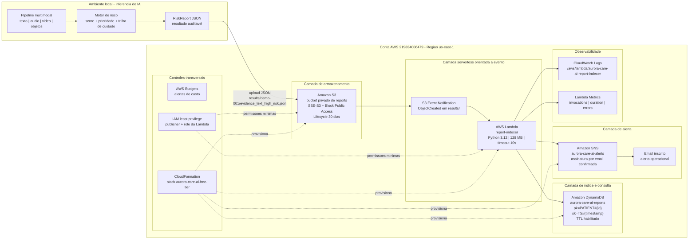

# Arquitetura AWS - Aurora Care AI

## Status da implementacao

Esta versao descreve a integracao AWS realmente executada no projeto.

O processamento de IA permaneceu local para evitar custo com GPU ou servicos gerenciados pagos. A AWS foi usada como uma camada serverless de persistencia, indexacao e evidencias operacionais.

Regiao usada: `us-east-1`  
Stack CloudFormation: `aurora-care-ai-free-tier`  
Status observado: `CREATE_COMPLETE`

## Servicos usados

| Servico | Recurso | Finalidade |
| --- | --- | --- |
| CloudFormation | `aurora-care-ai-free-tier` | Provisionamento rastreavel da infraestrutura |
| S3 | `aurora-care-ai-219834006479-us-east-1-reports` | Armazenamento privado dos reports JSON |
| Lambda | `aurora-care-ai-report-indexer` | Processamento automatico de eventos do S3 |
| DynamoDB | `aurora-care-ai-reports` | Indice consultavel dos reports por paciente |
| CloudWatch Logs | `/aws/lambda/aurora-care-ai-report-indexer` | Evidencia de execucao da Lambda |
| SNS | `aurora-care-ai-alerts` | Envio de alertas por email |
| AWS Budgets | Budget mensal | Controle preventivo de custo |

## Diagrama de arquitetura AWS validado

### Leitura do diagrama

- A inferencia pesada permanece fora da AWS para controlar custo e evitar GPU em cloud.
- O S3 e o ponto de entrada cloud: recebe somente o report JSON, nao midia bruta.
- A arquitetura e event-driven: o upload no S3 dispara a Lambda automaticamente.
- A Lambda nao executa inferencia; ela faz integracao, indexacao e alerta.
- O DynamoDB armazena metadados para historico/consulta, nao o payload completo do exame.
- O SNS envia alerta por email para casos configurados como risco alto ou urgente.
- CloudWatch registra execucao, metricas e troubleshooting da Lambda.
- CloudFormation, IAM e Budget sustentam governanca, reproducibilidade e controle de custo.

## Fluxo tecnico

1. A inferencia multimodal foi executada localmente.
2. O pipeline gerou um report JSON em `data/results/evidence_text_high_risk.json`.
3. O arquivo foi enviado ao S3 em `results/demo-001/evidence_text_high_risk.json`.
4. O bucket S3 disparou automaticamente um evento `ObjectCreated`.
5. A Lambda `aurora-care-ai-report-indexer` foi invocada.
6. A Lambda leu o JSON no S3 e gravou um item na tabela DynamoDB.
7. A execucao ficou registrada no CloudWatch Logs e nas metricas da Lambda.

## Evidencias observadas

| Evidencia | Resultado |
| --- | --- |
| CloudFormation | Stack `aurora-care-ai-free-tier` criada com status `CREATE_COMPLETE` |
| S3 | Objeto `evidence_text_high_risk.json` presente no bucket de reports |
| DynamoDB | Scan retornou 1 item na tabela `aurora-care-ai-reports` |
| Lambda Monitor | Houve invocacoes registradas |
| CloudWatch Logs | Log stream criado para `/aws/lambda/aurora-care-ai-report-indexer` |
| Budget | Alertas de custo configurados antes da criacao dos recursos |

## Observacoes importantes

### Upload

O script `scripts/publish_report_aws.py` foi preparado para envio via boto3, mas o envio local apresentou travamento no terminal. Para concluir a evidencia da integracao, o upload do JSON foi feito manualmente pelo console do S3.

### Patient ID

O item validado no DynamoDB apareceu como `PATIENT#unknown`. Isso aconteceu porque o arquivo enviado era o JSON puro do report, sem envelope contendo `patient_id`. A arquitetura suporta o campo `patient_id`, mas o teste manual validou principalmente a cadeia S3 -> Lambda -> DynamoDB.

### SNS

O topico SNS `aurora-care-ai-alerts` foi criado e a assinatura por email foi confirmada. Portanto, o SNS pode ser apresentado como componente validado de alerta.

Quando a Lambda identifica um nivel de risco configurado para alerta, ela publica uma mensagem no topico SNS, que encaminha a notificacao para o email inscrito.

### CloudWatch

O CloudWatch confirmou invocacoes da Lambda. Alguns eventos exibiram `JSONDecodeError`, associados a tentativas de processamento de conteudo invalido ou fora do formato esperado. Para a apresentacao, isso deve ser tratado como evidencia de execucao e ponto de melhoria, nao como execucao perfeita.

## Seguranca e custo

Medidas aplicadas:

- Budget configurado antes da criacao dos recursos.
- Uso da regiao unica `us-east-1`.
- S3 com Block Public Access.
- S3 com criptografia SSE-S3.
- Bucket policy negando transporte inseguro.
- Lifecycle no S3 com retencao de 30 dias.
- DynamoDB com TTL.
- DynamoDB com capacidade provisionada minima: 1 RCU / 1 WCU.
- CloudWatch Log Group com retencao de 7 dias.
- Lambda com 128 MB e timeout de 10 segundos.
- Sem EC2 ou servicos de IA pagos na nuvem.

## Como explicar no trabalho

Frase tecnica recomendada:

"Eu mantive a inferencia multimodal local para controlar custo e usei AWS como camada serverless de integracao: o report JSON e armazenado em S3 privado com criptografia SSE-S3, um evento ObjectCreated aciona uma Lambda, a Lambda indexa metadados no DynamoDB, a execucao fica auditavel via CloudWatch Logs e o SNS envia alertas por email para casos configurados como risco alto ou urgente."

## Relacao com o requisito academico

O professor informou que nao era necessario rodar tudo em cloud. A implementacao atende ao criterio porque integra uma parte da solucao de IA com AWS usando servicos serverless reais:

- S3 para persistencia do resultado de IA.
- Lambda para automacao baseada em evento.
- DynamoDB para historico/indexacao.
- CloudWatch para observabilidade.

## Artefatos do projeto

- `infra/aws/free_tier_stack.yaml`: template CloudFormation usado para criar a infraestrutura.
- `scripts/publish_report_aws.py`: script preparado para publicar reports no S3.
- `docs/aws_step_by_step.md`: guia operacional da etapa AWS.
- `docs/Aurora_Care_AI_AWS_Integration.pptx`: apresentacao da integracao AWS.
- `docs/canva_assets/arquitetura_completa_aurora_aws.svg`: imagem editavel da arquitetura.
- `docs/canva_assets/fluxo_serverless_aws.svg`: imagem editavel do fluxo serverless.
