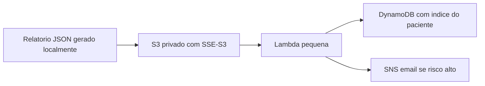

# AWS etapa final - guia seguro para ate US$100

Este guia assume que voce nunca usou AWS. A ideia e fazer a entrega com o menor risco possivel de custo: primeiro criar alertas de gasto, depois subir somente S3 + DynamoDB + Lambda + SNS. EC2 fica como opcional.

Data de referencia: 2026-05-19.

## 0. Regra de ouro do orcamento

Seu limite e US$100. Entao a estrategia do projeto e:

- Nao usar SageMaker, Comprehend, Transcribe, Rekognition, Bedrock, RDS, NAT Gateway, Load Balancer, WAF, KMS CMK, EKS/ECS ou API Gateway.
- Nao subir GPU.
- Nao deixar EC2 ligado sem necessidade.
- Nao criar Elastic IP separado.
- Nao armazenar video/audio bruto no S3; enviar apenas JSON de resultado.
- Usar SSE-S3, que e criptografia server-side do S3 sem chave KMS paga.

Importante: contas AWS criadas em ou apos 2025-07-15 usam um modelo novo de Free Tier com creditos. Contas mais antigas, se ainda estiverem nos primeiros 12 meses, podem ter o Free Tier classico. Como voce mencionou US$100, trate isso como credito finito: se gastar, acabou.

## 1. Antes de criar qualquer recurso: travas de custo

Entre no Console AWS.

1. Abra "Billing and Cost Management".
2. Abra "Budgets".
3. Crie um budget mensal de custo com valor baixo, por exemplo US$10.
4. Configure alertas por email em 50%, 80% e 100%.
5. Abra "Free Tier" ou "Credits" no painel de Billing e confirme quanto credito resta.
6. Ative alertas de Free Tier usage, se aparecer essa opcao na sua conta.

Por que US$10 se o saldo e US$100? Porque alerta de budget nao e trava de cartao. Ele avisa depois que a AWS calcula o uso. Um budget baixo te da tempo de parar antes de virar susto.

## 2. Regiao recomendada

Use `us-east-1` para a entrega.

Motivos:

- Geralmente tem maior disponibilidade de recursos Free Tier.
- E a regiao padrao do projeto em `src/config.py`.
- Evita criar recursos espalhados em varias regioes.

Regra pratica: antes de clicar em qualquer servico, confira no canto superior direito se a regiao esta `N. Virginia / us-east-1`.

## 3. Arquitetura que vamos subir



Nesta versao segura, o processamento pesado continua local. A AWS guarda o resultado, cria indice e envia alerta. Isso prova integracao cloud sem pagar por IA gerenciada.

## 4. Criar a infraestrutura com CloudFormation

O arquivo pronto esta em:

`infra/aws/free_tier_stack.yaml`

No Console AWS:

1. Pesquise por "CloudFormation".
2. Clique em "Create stack".
3. Escolha "With new resources".
4. Em "Specify template", escolha "Upload a template file".
5. Envie `infra/aws/free_tier_stack.yaml`.
6. Clique em "Next".
7. Stack name: `aurora-care-ai-free-tier`.
8. ProjectName: `aurora-care-ai`.
9. AlertEmail: coloque seu email.
10. RetentionDays: use `30`.
11. Clique em "Next".
12. Em permissions/capabilities, marque a confirmacao de que a stack cria recursos IAM.
13. Clique em "Submit".

Quando terminar, a stack deve mostrar `CREATE_COMPLETE`.

Depois disso:

1. Abra seu email.
2. Procure uma mensagem da AWS Notifications.
3. Clique em "Confirm subscription".

Sem essa confirmacao, SNS nao envia alertas por email.

## 5. O que essa stack cria

- Um bucket S3 privado para reports JSON.
- Bloqueio total de acesso publico no S3.
- Criptografia SSE-S3.
- Regra de expiracao automatica depois de `RetentionDays`.
- Uma tabela DynamoDB com chave `pk` e `sk`.
- TTL no DynamoDB para expirar indice antigo.
- Uma Lambda Python 3.12 de 128 MB.
- Um topico SNS para email.
- Uma politica IAM minima para publicar reports no S3.

Ela nao cria EC2, banco relacional, API Gateway, KMS pago ou servicos de IA pagos.

## 6. Pegar os nomes dos recursos

No CloudFormation:

1. Abra a stack `aurora-care-ai-free-tier`.
2. Clique na aba "Outputs".
3. Copie:
   - `ReportBucketName`
   - `ReportsTableName`
   - `AlertTopicArn`
   - `PublisherPolicyArn`

Guarde esses valores para o teste.

## 7. Criar usuario IAM apenas para publicar no S3

Para rodar o teste do seu computador, voce precisa de credenciais. Nunca use a conta root para isso.

No Console AWS:

1. Pesquise por "IAM".
2. Abra "Users".
3. Clique em "Create user".
4. Nome: `aurora-publisher-demo`.
5. Nao precisa marcar acesso ao console.
6. Na etapa de permissoes, escolha "Attach policies directly".
7. Pesquise a policy criada pela stack: `aurora-care-ai-publisher-s3-only`.
8. Conclua a criacao.
9. Abra o usuario criado.
10. Aba "Security credentials".
11. Crie uma access key para "Command Line Interface".
12. Salve `Access key ID` e `Secret access key`.

Depois da apresentacao, volte aqui e apague essa access key.

## 8. Configurar credenciais no seu computador

No PowerShell, dentro do projeto:

```powershell
$env:AWS_DEFAULT_REGION="us-east-1"
$env:AWS_ACCESS_KEY_ID="COLE_AQUI_ACCESS_KEY_ID"
$env:AWS_SECRET_ACCESS_KEY="COLE_AQUI_SECRET_ACCESS_KEY"
$env:AURORA_AWS_BUCKET="COLE_AQUI_ReportBucketName"
```

Essas variaveis valem apenas para o terminal atual. Fechou o terminal, somem. Isso e bom para nao deixar segredo gravado no projeto.

## 9. Teste sem enviar nada

Rode:

```powershell
.\.venv\Scripts\python.exe scripts\publish_report_aws.py data\results\evidence_text_high_risk.json --patient-id demo-001
```

Resultado esperado:

```text
Dry run OK.
Would upload: ...
Add --send when you are ready.
```

Esse teste nao chama a AWS.

Se o Python da `.venv` falhar, crie um ambiente novo separado para este teste:

```powershell
py -3.12 -m venv .venv-aws
.\.venv-aws\Scripts\python.exe -m pip install -r requirements.txt
.\.venv-aws\Scripts\python.exe scripts\publish_report_aws.py data\results\evidence_text_high_risk.json --patient-id demo-001
```

## 10. Enviar um report de verdade

Quando o dry run estiver certo:

```powershell
.\.venv\Scripts\python.exe scripts\publish_report_aws.py data\results\evidence_text_high_risk.json --patient-id demo-001 --send
```

Resultado esperado:

```json
{
  "s3_bucket": "...",
  "s3_key": "results/demo-001/..."
}
```

Depois disso, a Lambda deve rodar automaticamente e gravar um item no DynamoDB.

## 11. Conferir se funcionou

S3:

1. Abra "S3".
2. Abra o bucket da stack.
3. Entre em `results/demo-001/...`.
4. Confirme que existe um `.json`.

DynamoDB:

1. Abra "DynamoDB".
2. Abra "Tables".
3. Abra `aurora-care-ai-reports`.
4. Clique em "Explore table items".
5. Procure `PATIENT#demo-001`.

SNS:

- Se o report tiver nivel alto/urgente, verifique o email confirmado.
- Se nao chegar email, confira primeiro se a inscricao SNS foi confirmada.

Lambda:

1. Abra "Lambda".
2. Abra `aurora-care-ai-report-indexer`.
3. Aba "Monitor".
4. Veja se houve invocacao e erro zero.

## 12. EC2 opcional, somente se for exigido

Use EC2 so se a entrega pedir a aplicacao rodando na nuvem. Para a maioria das demonstracoes, a integracao S3/Lambda/DynamoDB/SNS ja prova a etapa AWS.

Se precisar usar EC2:

1. Escolha uma instancia marcada como Free Tier eligible.
2. Prefira Amazon Linux.
3. Use `t3.micro` ou outra opcao Free Tier elegivel mostrada pela sua conta.
4. Disco EBS: 8 GB gp3.
5. Security Group:
   - SSH porta 22 apenas para seu IP.
   - Porta 8000 apenas para seu IP, se for demonstrar FastAPI.
6. Nao crie Elastic IP separado.
7. Pare ou termine a instancia ao final da demo.

Para economizar, nao rode treino na EC2. Treino e processamento pesado ficam local.

## 13. Checklist de encerramento para nao gastar depois

Depois da apresentacao:

1. CloudFormation > stack > Delete.
2. S3 > se a stack falhar ao deletar, esvazie o bucket e tente deletar de novo.
3. IAM > Users > `aurora-publisher-demo` > delete access key.
4. EC2 > confirme que nao ha instancias running.
5. EC2 > Elastic IPs > confirme que nao ha IP alocado.
6. EBS > Volumes e Snapshots > confirme que nao sobrou nada extra.
7. Billing > veja o custo do mes e o saldo de credito.

## 14. Como explicar na apresentacao

Frase curta:

"A inferencia multimodal roda localmente para evitar custo de GPU e servicos gerenciados pagos. A AWS e usada para persistencia segura e rastreavel dos resultados: S3 criptografado armazena os JSONs, Lambda indexa os eventos, DynamoDB permite historico por paciente pseudonimizado e SNS envia alertas para revisao humana."

Pontos de seguranca:

- S3 privado com Block Public Access.
- Criptografia em repouso com SSE-S3.
- Trafego via HTTPS.
- ID de paciente pseudonimizado.
- Retencao automatica por lifecycle/TTL.
- Sem diagnostico automatico; alerta e triagem para revisao humana.

## 15. Fontes oficiais consultadas

- EC2 Free Tier e mudanca por data de criacao da conta: https://docs.aws.amazon.com/AWSEC2/latest/UserGuide/ec2-free-tier-usage.html
- DynamoDB Free Tier: https://docs.aws.amazon.com/amazondynamodb/latest/developerguide/Introduction.html
- Lambda Free Tier: https://aws.amazon.com/lambda/pricing/
- S3 Free Tier em tutorial oficial: https://docs.aws.amazon.com/hands-on/latest/backup-files-to-amazon-s3/backup-files-to-amazon-s3.html
- AWS Budgets: https://aws.amazon.com/aws-cost-management/aws-budgets/pricing/
