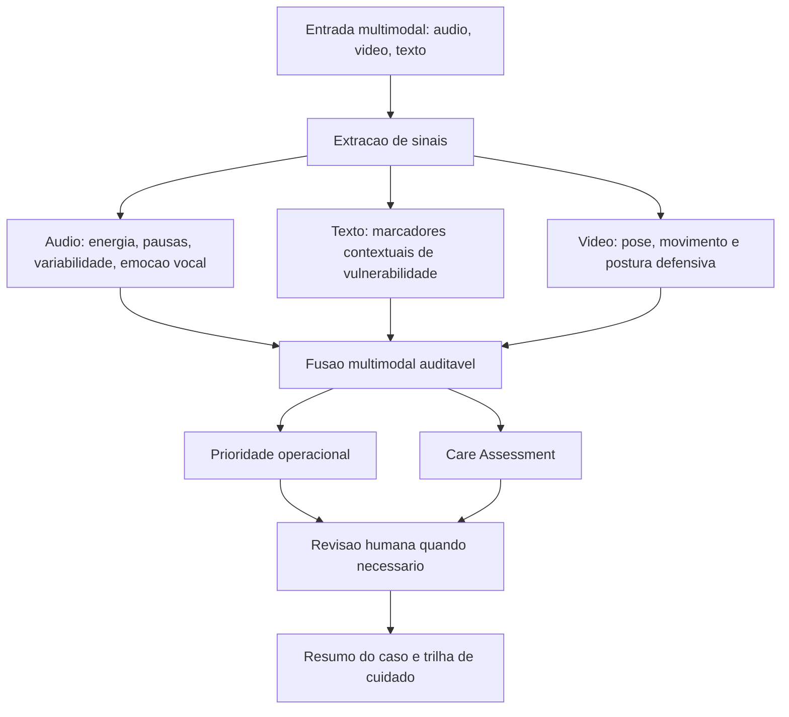

# Aurora Care AI - Roteiro do Relatorio Final

## 1. Introducao

Apresentar o problema: monitoramento preventivo de bem-estar psicologico e vulnerabilidade feminina a partir de sinais multimodais. Explicitar que o sistema nao diagnostica violencia domestica; ele identifica sinais de atencao para revisao humana.

## 2. Objetivo

Desenvolver um pipeline com IA integrada capaz de processar texto, audio e video para estimar sinais de sofrimento afetivo, possivel vulnerabilidade e necessidade de acompanhamento.

## 3. Justificativa

Casos de violencia domestica e sofrimento psicologico podem se manifestar de forma indireta. Por questoes eticas e legais, datasets reais multimodais de violencia domestica sao raros. A abordagem adotada e detectar sinais correlatos e encaminhar casos para revisao humana.

## 4. Arquitetura

Fluxo proposto:

## 5. Datasets

- RAVDESS: reconhecimento emocional multimodal.
- CREMA-D: reconhecimento emocional audiovisual com maior diversidade.
- UC3M4Safety/WEMAC: fundamentacao com perspectiva de genero e computacao afetiva.
- DAIC-WOZ: base relevante para sofrimento psicologico, pendente de acesso formal.
- UCF-Crime/anomalias: baseline visual exploratorio, com limitacao de dominio.

## 6. Metodologia

1. Indexacao dos datasets emocionais.
2. Extracao de features acusticas.
3. Treino de baseline emocional com Logistic Regression.
4. Analise textual por marcadores auditaveis.
5. Analise visual por movimento/postura.
6. Fusao multimodal ponderada por confianca.
7. Care Assessment com trilhas de cuidado e guardrails.

## 7. Resultados Iniciais

Baseline emocional por audio:

- Accuracy: 42.7%.
- Macro-F1: 38.7%.
- Weighted-F1: 38.7%.

Interpretacao: resultado inicial, limitado por features acusticas simples, mas suficiente como baseline experimental para comparacao futura.

## 8. Etica, LGPD e Governanca

- Minimizar coleta de dados sensiveis.
- Armazenar apenas o necessario.
- Evitar decisao automatizada final em contexto sensivel.
- Sinalizar incerteza e fora de dominio.
- Exigir revisao humana para alertas e casos incertos.
- Documentar vieses e falsos positivos.
- Adotar comunicacao trauma-informada: sem julgamento, sem pressionar por detalhes e com consentimento.

## 9. Limitacoes

- O modelo emocional foi treinado em datasets controlados.
- O audio longo pode estar fora do dominio de treino.
- A heuristica textual ainda nao substitui NLP contextual robusto.
- A modalidade visual ainda precisa de avaliacao mais ampla.
- O sistema nao identifica violencia domestica diretamente.

## 10. Proximos Passos

- Adicionar MFCCs e features espectrais.
- Treinar modelos nao lineares.
- Integrar BERTimbau/embeddings para texto.
- Avaliar modelo facial/video com frames.
- Criar dashboard de revisao humana.
- Solicitar acesso formal ao WEMAC completo e DAIC-WOZ.
